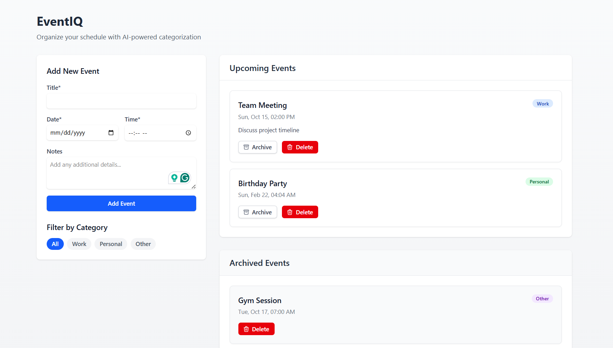

# EventIQ - AI-Powered Event Scheduler

 <!-- Add a screenshot if available -->

## Overview
EventIQ is a full-stack event scheduling application with AI-powered categorization. It helps users organize events (meetings, reminders, etc.) by automatically categorizing them as "Work", "Personal", or "Other" based on content analysis.

**Live Demo**: [https://mini-event-scheduler.netlify.app/](https://mini-event-scheduler.netlify.app/)

## Features

### Frontend (React + TypeScript + Tailwind CSS)
- 📅 Create events with title, date, time, and optional notes
- 🏷️ Automatic AI categorization of events
- ✅ Mark events as archived
- 🗑️ Delete events
- 📱 Fully responsive design
- 🎨 Clean UI with Tailwind CSS

### Backend (Node.js + Express + TypeScript)
- 🚀 RESTful API endpoints for CRUD operations
- 🤖 AI-based categorization logic
- ⚡ In-memory data storage (for demo purposes)
- 🔒 Input validation and proper HTTP status codes

## Tech Stack

**Frontend**:
- React (Vite)
- TypeScript
- Tailwind CSS
- Date-fns (for date handling)

**Backend**:
- Node.js
- Express
- TypeScript
- CORS middleware

## Installation

### Prerequisites
- Node.js (v16 or higher)
- npm or yarn

### Backend Setup
1. Navigate to the backend folder:
   ```bash
   cd server
   ```
2. Install dependencies:
   ```bash
   npm install
   ```
3. Start the development server:
   ```bash
   npm run dev
   ```
   The backend will run on `http://localhost:5000`

### Frontend Setup
1. Navigate to the frontend folder:
   ```bash
   cd client
   ```
2. Install dependencies:
   ```bash
   npm install
   ```
3. Start the development server:
   ```bash
   npm run dev
   ```
   The frontend will run on `http://localhost:5173`

## API Endpoints

| Method | Endpoint    | Description                          |
|--------|-------------|--------------------------------------|
| POST   | /api/events | Create a new event                   |
| GET    | /api/events | Get all events (sorted by date/time) |
| PUT    | /api/events/:id | Archive an event                |
| DELETE | /api/events/:id | Delete an event                 |

## AI Categorization Logic
Events are categorized based on keywords:
- **Work**: meeting, project, client, work, office
- **Personal**: birthday, family, friend, personal, holiday
- **Other**: Default category when no keywords match

## Deployment
The application is deployed using:
- Frontend: Netlify
- Backend: Render

